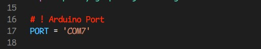

# 📝 การติดตั้งโปรแกรม

## 📌 สิ่งที่จำเป็น
1. `python` (แนะนำเวอร์ชัน 3.9.4)
2. `venv` module (เครื่องมือสำหรับการสร้าง virtual environments บน python)
3. (Optional) `git`

## 🔍 ขั้นตอนการดาวน์โหลดซอร์สโค้ด
### 🔸วิธีที่ 1 : ดาวน์โหลดไฟล์ .zip
1. ดาวน์โหลดโปรเจคบนกิตฮับ (GitHub) ที่อยู่ลิงก์ [project-cs-tu-presure-matress-main.zip](https://github.com/soycoder/project-cs-tu-presure-matress/archive/refs/heads/main.zip)
2. แตกไฟล์ .zip

3. ไปยังโฟลเดอร์ project-cs-tu-presure-matress-main

### 🔸วิธีที่ 2 : Cloning ผ่าน git

1. Cloning โปรเจค

        git clone https://github.com/soycoder/project-cs-tu-presure-matress.git

2. เลือกเวอร์ชัน CS403

        cd project-cs-tu-presure-matress
        git checkout -b CS403

## ⚙️ ขั้นตอนการติดตั้งโปรแกรม
1. สร้าง `Environment` สำหรับโปรแกรม

        python -m venv .env

2. เข้าถึง `Environment` ด้วยคำสั่ง ดังนี้

    - สำหรับ Windows (`PowerShell`)

            .env\Scripts\Activate.ps1

    - สำหรับ Windows (`Command Prompt` หรือ `CMD`)

            .env\Scripts\activate.bat

    - สำหรับ `Linux` หรือ `MacOS`

            .env/Scripts/activate

3. ติดตั้ง `Python Packages` ที่จำเป็น
        
        python -m pip install -r requirements.txt

4. ตรวจสอบ `USB Port` สำหรับรับข้อมูล แก้ไข COM Port ดังภาพ 

    - เปิดไฟล์ `./python/genMat32-calibrated.py บรรทัดที่ 17`  ( [เปิด](./python/genMat32-calibrated.py#L17) )

    - ภาพตัวอย่างการแก้ไข COM Port

        

5. `รันโปรแกรม` โดยต้องการรัน 2 ส่วนพร้อมกัน

    - สำหรับ `เว็บแอปพลิเคชัน`

                cd dashboard
                python app.py

    - สำหรับ `รับข้อมูลจากอุปกรณ์วัดแรงกดทับ`
    
                cd python 
                python genMat32-calibrated.py

